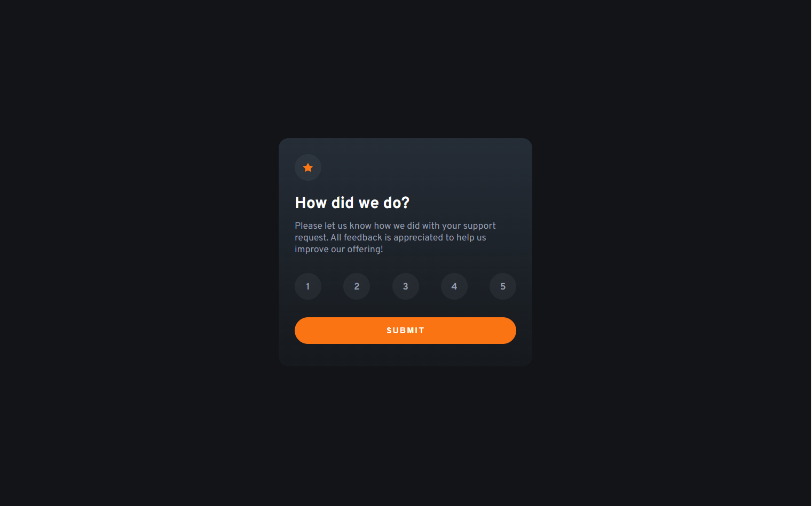
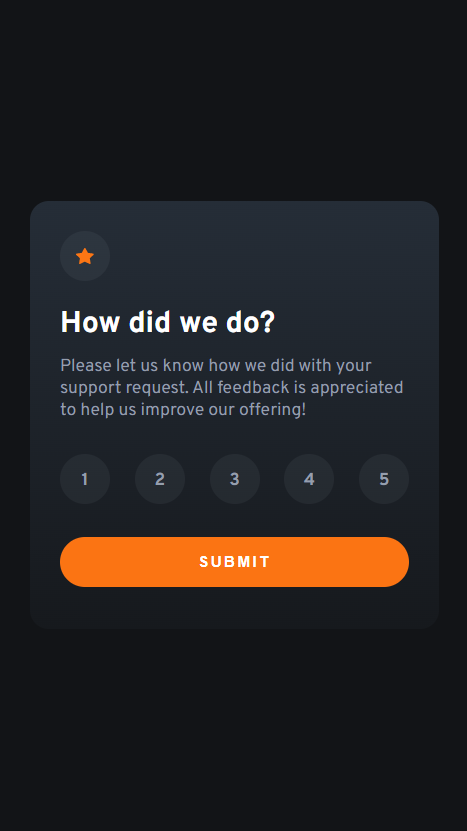
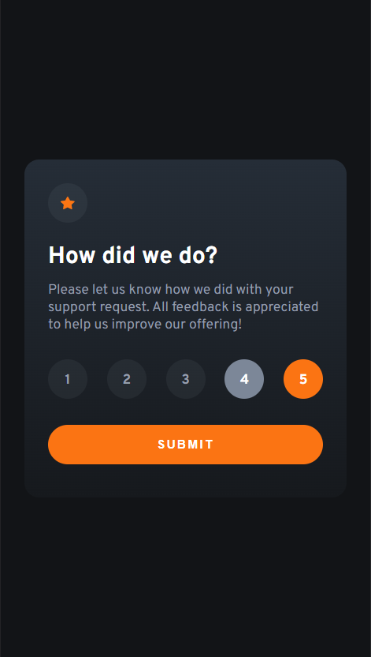
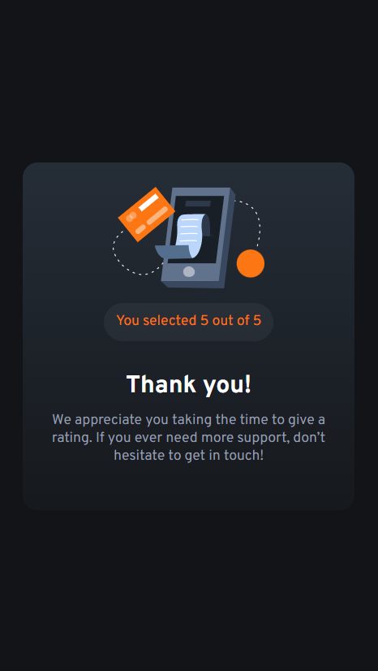

# Frontend Mentor - Interactive rating component solution

This is a solution to the [Interactive rating component challenge on Frontend Mentor](https://www.frontendmentor.io/challenges/interactive-rating-component-koxpeBUmI).

## Table of contents

- [Frontend Mentor - Interactive rating component solution](#frontend-mentor---interactive-rating-component-solution)
  - [Table of contents](#table-of-contents)
  - [Overview](#overview)
    - [The challenge](#the-challenge)
    - [Screenshot](#screenshot)
    - [Links](#links)
  - [My process](#my-process)
    - [Built with](#built-with)
    - [What I learned](#what-i-learned)
    - [Continued development](#continued-development)
    - [Useful resources](#useful-resources)
  - [Author](#author)

## Overview

### The challenge

Users should be able to:

- View the optimal layout for the app depending on their device's screen size
- See hover states for all interactive elements on the page
- Select and submit a number rating
- See the "Thank you" card state after submitting a rating

### Screenshot

### Links

- Solution URL: [Interactive rating card code](https://github.com/DamianRi/interactive-rating-component-main/)
- Live Site URL: [Interactive rating card live](https://damianri.github.io/interactive-rating-component-main/)

## My process

### Built with

- Semantic HTML5 markup
- CSS custom properties
- Flexbox; for the card content
- Mobile-first workflow
- Javascript for card events

### What I learned

I practiced the _eventListener_ functions to manage the events in the rating options and submit button.

### Continued development

I want to continue practice in more general events with Js.

### Useful resources

- [EventListener](https://developer.mozilla.org/es/docs/Web/API/EventTarget/addEventListener) - This help me to add the listener for the event click for the options in rating. Also, for the click in the _submit_ button.
- [ClassList](https://developer.mozilla.org/en-US/docs/Web/API/Element/classList) - This help me to add or remove the _active_ class for the elements in the card.
- [HTML value attribute](https://developer.mozilla.org/en-US/docs/Web/API/HTMLDataElement/value) - This help me to handled the rating selected to submit. 

## Author

- Website - [Still working on](https://www.---.com)
- Frontend Mentor - [@DamianRi](https://www.frontendmentor.io/profile/DamianRi)
